Instead of recordeing the foundamental knowledge in [[DSA1101]], this cheatsheet is focusing on the real part in the code implementation or some "how to interpret" questions... 
Mainly stems from the lecture slides, Tutorial slides, on-site, off-site questions and so on.

# R introduction

Elements in vectors and matrices must be the same mode
Dataframe is similar to the Matrix object but columns can have different modes.

**Where do we use list topic 1 page 9**

```R
df[1:4,2:3]
# use square bracket to index dataframe

# more general, assessing parts of a df by conditions
df[gender == 'male',] # don't forget the ','

# if we want more conditions
df[gender == 'male' & CA2 > 85,]
```

read files: topic 1 page 30

**When should we use attach(df) topic page 38**

## Common commands

`nrow(df)` report the num of rows
`ncol(df)` report the num of cols

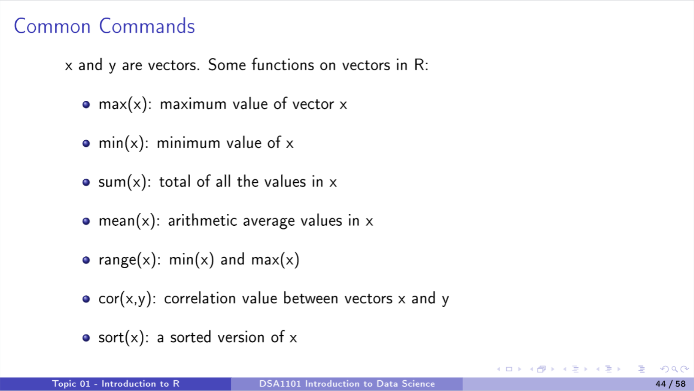

**use of correlation value?**

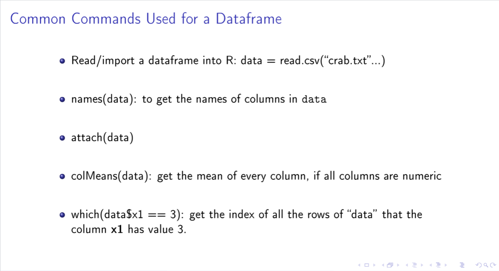

which gives us the index

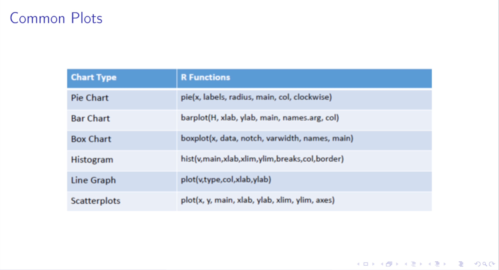

### Create a box chart

Q:  Create box plots of car's price by groups of year for year 2016 to 2020. **Give your comments**

?what should be in the comments?

```R
boxplot(price ~ year, # x: 公式 (Y ~ Group) 
        data = df[df$year >= 2016 & df$year <= 2020,] # 数据源 
        main = "Car Prices by Year", # 标题 (必填) 
        xlab = "Year", 
        ylab = "Price", 
        # --- 进阶参数 --- 
        notch = TRUE, # 开启"收腰": 缺口不重叠 = 中位数显著不同 
        varwidth = TRUE, # 开启"变宽": 箱子越胖 = 数据量(n)越大 
        col = "lightblue"
        )
```

**Comments**:

- **Trend**. e.g: The median price seems to increase from 2016 to 2020. (the black line of the box)
- **Spread**. e.g: The variation in prices is larger in 2020 compared to 2016. (the height of the box IQR)
- **Outliers**. e.g: There are significant outliers on the higher end for all years.

## Loops, conditions and functions

### Loops

- while loop
  
  ```R
  while (condition) {expression}
  ```

## Data wrangling

### How to change a lot of values in one column

~~SOP:

- ~~get access to the specific column~~
- ~~which filter the specific index of what we want
- ~~how can we change those value? for loop?

we should avoid use **for loop** in R, 'cause R is a vectorized language, we could do batch manipulation

and the original SOP is a bit complex

```R
# structure: df$column[condition] = new value 
df$column[df$column == "Other"] = "Hybrid"
```

### Remove data out of our scope (not remove but keep)

SOP:

- clarify the conditions

```R
# we don't execute remove, but execute "keep/filter"
data = data[data$year <= 2026, ]
```

### Create Contingency Table and report number in specific condition

~~SOP~~

- ~~clarify the conditions
  ~~
  Instead, we need to use correct function `table()`
  
  ```R
  tab1 = table(row_variable, col_variable) # cols in df are vectors
  tab1 = table(data$transmission, data$fuelType)
  ```

print(tab1) # use this line to check

# report specific number

tab1["RowName", "ColName"]
tab1["Automatic", "Petrol"]

addmargins(tab1) # 给表加上 Total 行和 Total 列

```
### Calculate probability in table

core func `prob.table(table_object, margin)`

- margin = 1, let the sum of every row = 1
- margin = 2, let the sum of every col = 1

```R
prob_tab = prop.table(tab2, margin = 2) 
print(prob_tab)

# we could use colSums to check
```

```R
# 提取概率
p_auto_high <- prob_tab["high", "Automatic"]
p_manual_high <- prob_tab["high", "Manual"] 
# 计算差值 
diff <- p_auto_high - p_manual_high 
print(diff)
```

How to interpret the difference?

- **The probability of a car being high-priced is 0.45 higher for automatic cars compared to manual cars.**

### Create new column by specific condition

```R
# df&col = ifelse(条件, 条件成立时的值, 条件不成立时的值)
data$priceHL = ifelse(data$price > 12500, "high", "low")
```

# General Utilities and Answer Formatting

```R
format_ans = function(x){
    if (abs(x) < 1){
        return (signif(x,3))
    } else {
        return (format(round(x,3), nsmall = 3))
    }
}
```

# Linear Regression

## SLR(Simple Linear Regression)

To express the total magnitude of the deviations, we sum up the squared residuals for all
the data points, **Residual Sum of Squares**, abbreviated as **RSS**

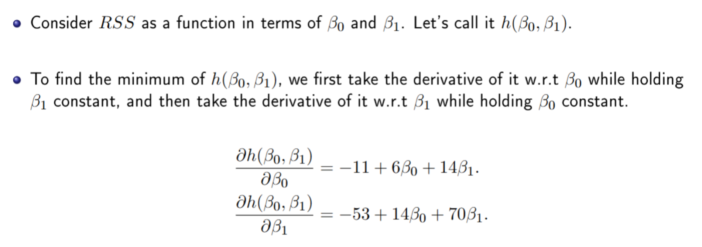

and set the partial derivatives to zero
The whole process(to get $\beta_0$ and $\beta_1$) is known as the method of **Ordinary Least Squares** (OLS)

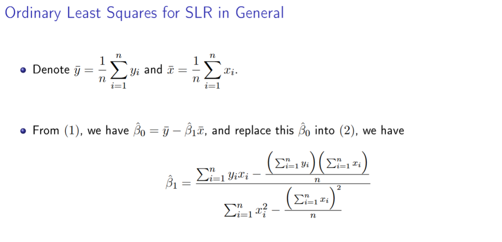

After the math background, we are heading to build the model, and use it to predict

```R
# build 
M = lm(vec1 ~ vec2, data = df)

>>> return intercept x(slope)

# create a new dataframe
new_df = data.frame(
    vec1 = c(), 
    vec2 = c()
) # names in the new_df must be the same as those in the model
# if we are predicting only one data point, we don't need to use c(), but it doesn't matter, lol

# predict
predict(model_name, newdata = new_df)
```

What if...

```R
# use of I()

#
```

## Goodness-of-fit of the model

run:

```R
summary(model_name)
```

to see the result

### F-test

To test if the whole model is significant or not

null hypothesis($H_0$):  all the coefficients, except intercept, are zero

If the test has small p-value (such as <0.05), then data provide strong evidence against
$H_0$. Otherwise, we cannot eliminate $H_0$

`F-statistic: 4.631 on 1 and 1 DF, p-value: 0.2769`

- 4.361: Signal/Noise
- 1(first): Model DF, $p$  the parameter used in the model
- 1(second): Residual DF,   $n - p - 1$  (总样本数 - 变量数 - 1)

注意样本量太少的情况，结果可能不可靠

### Coefficient of determination $R^2$

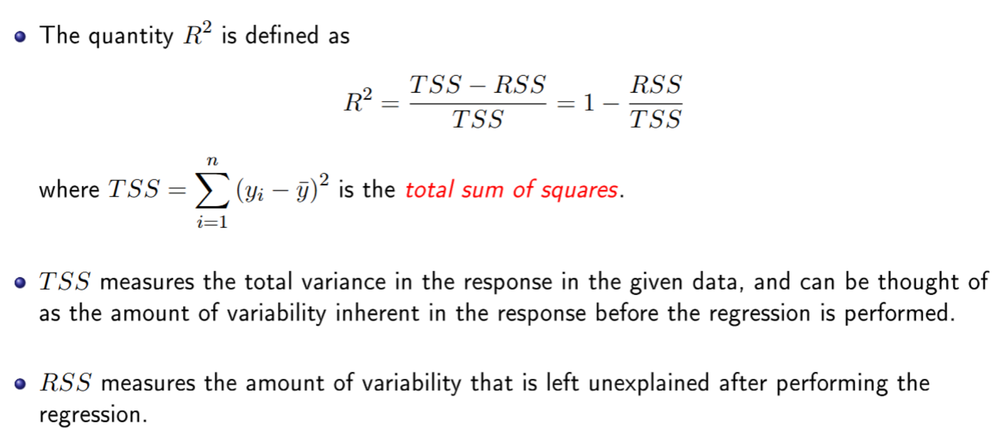

$1 - \frac{RSS}{TSS}$ = **模型成功解释的比例**
$R^2$ close to 1 means the model fitted well

use formula to solve R-squared

```R
> RSS =sum ((y- M$fitted )^2)
> TSS = var(y)*(length(y) -1)
> R2 = 1 - RSS/TSS;
```

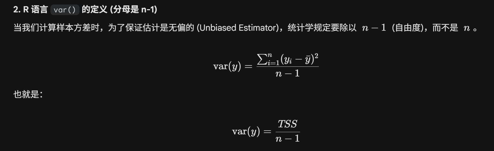

When we only have 1 variable, check **Multiple R-squared**, otherwise, check **adjusted R-squared**(which has the penalty mechanism)
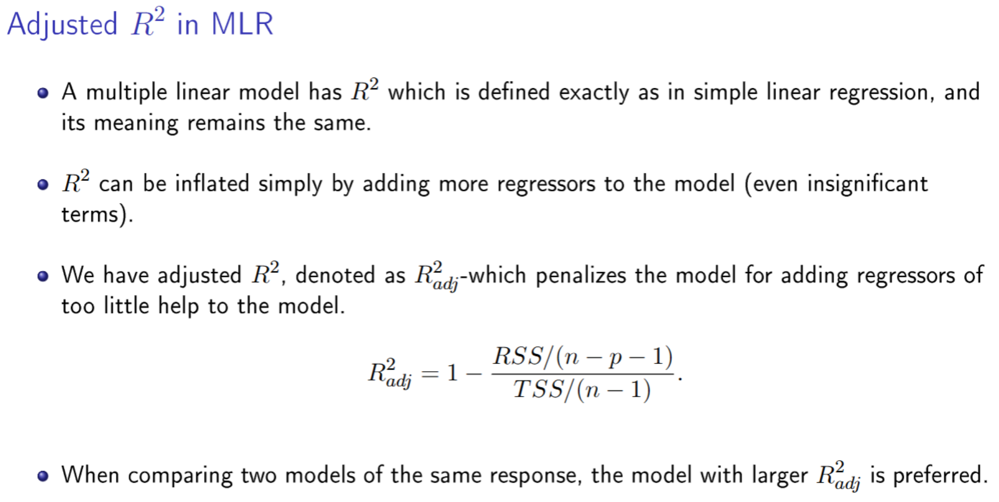

### Residual Standard Error (RSE)

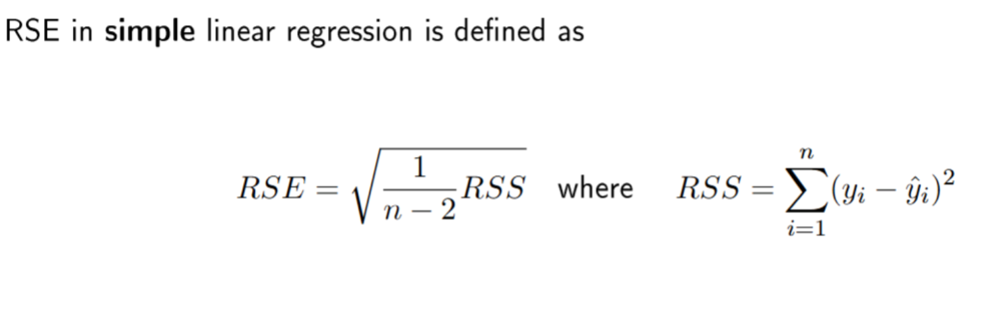

## Multiple Linear Regression

```R
# build the model
m = lm(y~x1 + x2, data = df)
```

## Find the correlation between variable1 and variable2

`cor(x,y)`

```R
# 1. Calculate correlation between Price and Mileage 
cor_1 = cor(1/data$price, data$mileage) 
print(cor_1)
```

?如果数据里有 `NA`，记得加上 `use = "complete.obs"`?

## What to do when having categorical variable

无脑加`as.factor()`

```R
model = lm(price ~ as.factor(fuelType) + as.factor(transmission) + mileage, data = df)
```

# KNN

## Fundamental Algorithm

just memorize the data, without training

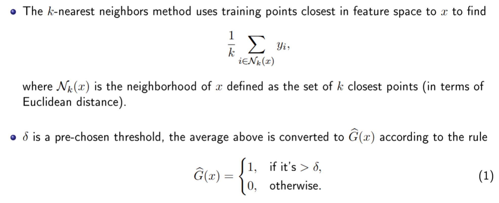

## Bias-variance tradeoff(what will happen when k changes)

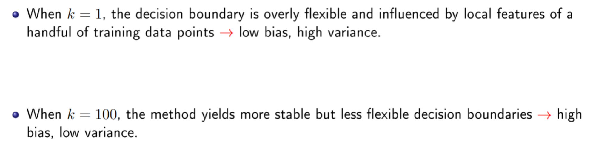

$$E\left[(Y - \hat{f}(x))^2\right] = \underbrace{(E[\hat{f}(x)] - f(x))^2}_{\text{Bias}^2} + \underbrace{E\left[(\hat{f}(x) - E[\hat{f}(x)])^2\right]}_{\text{Variance}} + \underbrace{\sigma^2}_{\text{Irreducible Error}}$$

### Bias

$$\text{Bias}[\hat{f}(x)] = E[\hat{f}(x)] - f(x)$$
Distance from the model to the function we want to fit
High means that the model's assumption is too strong(such as linear model, which assumes that the world is linear)

### Variance

$$\text{Variance}[\hat{f}(x)] = E\left[ (\hat{f}(x) - E[\hat{f}(x)])^2 \right]$$

Model over-relies on the specific data we used

单个模型 $\hat{f}(x)$ 偏离它自己平均水平 $E[\hat{f}(x)]$ 的程度

## Application

**use the `knn()` function from the `class` package in R**

### Inputs

- A **matrix** containing the predictors or features $x$ associated with the training data
- A **matrix** containing the predictors or features $x$ associated with the data for which we
  wish to make predictions
- A **vector** containing the class labels for the training data
- A **value** for $k$, the number of nearest neighbors to be used by the classiffier

### Data Preprocessing

- extract particular cols
- standarization

```R
# 1. 挑选出需要标准化的列 (Numeric features)
cols_to_scale = c("mileage", "tax", "mpg", "engineSize")

# 2. 创建新 data.frame
# 注意顺序：题目要求第一列是 priceHL
data.KNN = data.frame(
  priceHL = data$priceHL,           # 第一列：响应变量 (不变)
  scale(data[, cols_to_scale])      # 后几列：标准化后的特征
)

# 3. (可选但推荐) 检查一下结果
head(data.KNN)
```

### Train-test split

```R
# 1. 锁定随机种子 (必须先运行这行，否则每次抽样结果都不一样)
set.seed(210)

# 2. 生成随机索引 (Random Indices)
# 逻辑：从 1 到 总行数 中，随机抽取 一半(50%) 的数字
n_rows = nrow(data.KNN)
train.index = sample(1:n_rows, n_rows/2) # 1st parameter: range, 2nd parameter: number of the index

# 3. 创建 Train Set (使用正索引)
train.set = data.KNN[train.index, ]

# 4. 创建 Test Set (使用负索引 - 这里的减号 "-" 意思是 "exclude/排除")
test.set = data.KNN[-train.index, ]
```

### In practice

```R
# 0. 记得先加载包 (KNN 需要 class 包)
library(class)

# 1. 创建 K 的向量 (3, 5, ..., 25)
K <- seq(3, 25, 2)

# 2. 初始化存放结果的空向量 (Pre-allocate memory)
# 这一步不是必须的，但是是"好习惯"，能让代码跑得更快
fnr <- numeric(length(K))
accuracy <- numeric(length(K))

# 3. 锁定随机种子 (题目要求)
set.seed(210)

# 4. 开始循环
for(i in 1:length(K)) {

  # 当前的 k 值
  k_curr <- K[i]

  # --- 运行 KNN ---
  # train: 训练集特征 (排除第一列 Response)
  # test:  测试集特征 (排除第一列 Response)
  # cl:    训练集的标签 (第一列 Response)
  knn.pred <- knn(train = train.set[, -1], 
                  test = test.set[, -1], 
                  cl = train.set[, 1], 
                  k = k_curr)

  # --- 建立混淆矩阵 (Confusion Matrix) ---
  # table(真实值, 预测值)
  cm <- table(test.set[, 1], knn.pred)

  # --- 计算 Accuracy ---
  # (TP + TN) / Total
  # sum(diag(cm)) 是对角线之和 (预测对的数量)
  accuracy[i] <- sum(diag(cm)) / sum(cm)

  # --- 计算 FNR (False Negative Rate) ---
  # 题目定义: High-price is Positive.
  # FNR = FN / (TP + FN) = 漏报 / 所有真的High

  # 假设矩阵是 cm["high", "high"] 这种格式
  # FN (False Negative): 实际上是 "high", 但预测成了 "low"
  # 注意: 如果你的 levels 顺序不同，这里的索引位置可能不同，最好用名字索引
  FN <- cm["high", "low"] 
  TP <- cm["high", "high"]

  fnr[i] <- FN / (TP + FN)
}

# 5. 查看结果
# print(data.frame(K, accuracy, fnr))
```

### Further processing

Magic of Logical Indexing

```R
# --- 第一部分: 找出 FNR < 0.1 的所有 K ---

# 1. 创建逻辑索引 (Logical Indexing)
# 这一步会生成一个 TRUE/FALSE 的向量，告诉我们哪个位置满足条件
condition <- fnr < 0.1

# 2. 提取满足条件的数据，组装成矩阵
# cbind (Column Bind) 把三列拼在一起
good.fnr <- cbind(K = K[condition], 
                  fnr = fnr[condition], 
                  accuracy = accuracy[condition])

# 3. 查看并报告结果 (按题目要求写在注释里)
# print(good.fnr)


# --- 第二部分: 在好学生里选 Accuracy 最高的 ---

# 1. 在 good.fnr 矩阵里，找到 accuracy 那一列最大值的"位置" (Index)
# good.fnr[, "accuracy"] 取出准确率这一列
# which.max() 返回最大值所在的行号
best_idx <- which.max(good.fnr[, "accuracy"]) # importantv

# 2. 提取对应的 K 值
# 取出 best_idx 这一行的 "K" 列
best.K <- good.fnr[best_idx, "K"]

# 3. 报告 best.K 的详细信息
# print(good.fnr[best_idx, ]) 
# 或者手动写: best_stats <- good.fnr[best_idx, ]
```

### Predict single data point

```R
# 1. 准备原始数据统计量 (Original Statistics)
# 注意：一定要对应好列的顺序！(mileage, tax, mpg, engineSize)
cols <- c("mileage", "tax", "mpg", "engineSize")

# 计算原始数据的均值和标准差
mu <- colMeans(data[, cols])  # 这里的 data 是你最原始的 data frame
sigma <- apply(data[, cols], 2, sd)

# 2. 准备新数据点 (New Observation)
# 先把它写成一个跟原来一样的 data frame (未缩放的原始值)
new_car_raw <- data.frame(
  mileage = 30000, 
  tax = 110, 
  mpg = 60, 
  engineSize = 1
)

# 3. 手动标准化 (Manual Standardization)
# 公式: (New - Mean) / SD
new_car_scaled <- data.frame(
  mileage    = (30000 - mu["mileage"]) / sigma["mileage"],
  tax        = (110   - mu["tax"])     / sigma["tax"],
  mpg        = (60    - mu["mpg"])     / sigma["mpg"],
  engineSize = (1     - mu["engineSize"]) / sigma["engineSize"]
)

# 另一种更骚气的写法 (向量化操作，考试如果想省时间可以用):
# new_car_scaled <- new_car_raw
# for(col in cols) {
#    new_car_scaled[col] <- (new_car_raw[col] - mean(data[,col])) / sd(data[,col])
# }

# 4. 进行预测 (KNN Prediction)
# 这里的 train 和 cl 还是用原来的
# test 换成我们刚算出来的 new_car_scaled
library(class)
pred_label <- knn(train = train.set[, -1],  # 训练集特征
                  test = new_car_scaled,    # 测试集 (我们的新车)
                  cl = train.set[, 1],      # 训练集标签
                  k = best.K)               # 用你上一题算出来的最佳 K

# 5. 报告结果
print(pred_label)
```

### In real world

```R
# 正确的做法 (Real World)
# 1. 先切分
train_idx <- sample(1:nrow(data), nrow(data)/2)
train_raw <- data[train_idx, ]
test_raw  <- data[-train_idx, ]

# 2. 只从 Train 算统计量
train_mean <- mean(train_raw$mileage)
train_sd   <- sd(train_raw$mileage)

# 3. 应用到 Train
train_scaled <- (train_raw$mileage - train_mean) / train_sd

# 4. 应用到 Test (注意：这里用的必须是 train_mean, 不能用 test_mean!)
test_scaled  <- (test_raw$mileage  - train_mean) / train_sd
```

## Diagnostics

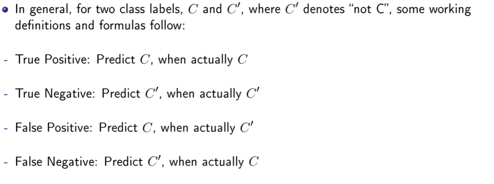

### Confusion Matrix

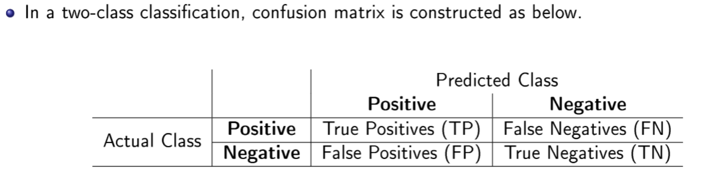

### 5 Metrics

#### Accuracy

- Defining the rate at which a model has classified the records correctly.

$$\text{Accuracy} = \frac{TP + TN}{TP + TN + FP + FN} * 100\%$$

A good model should have a high accuracy score, but having a high accuracy score alone
does not guarantee the model is well established. (Necessary, but not sufficient)

#### True Positive Rate(TPR)

- hows the proportion of positive instances the classifier correctly identified

$$\text TPR = \frac{TP}{TP + FN}$$

#### False Positive Rate(FPR  type 1 error rate)

- shows the percentage of negatives the classifier marked as positive

$$\text FPR = \frac{FP}{FP + TN}$$

#### False Negative Rate(FNR  type 2 error)

- shows the percent of positives the classifier marked as negatives.

$$\text FNR = \frac{FN}{FN + TP}$$

#### Precision

- the percentage of instances that are actually positive among the marked positives

$$\text Precision = \frac{TP}{TP + FP}$$

### In General

A well-performed classier should have a high TPR (ideally 1) and a low FPR and FNR
(ideally 0).

### In Practice

...

## N-Fold Cross-validation

...
